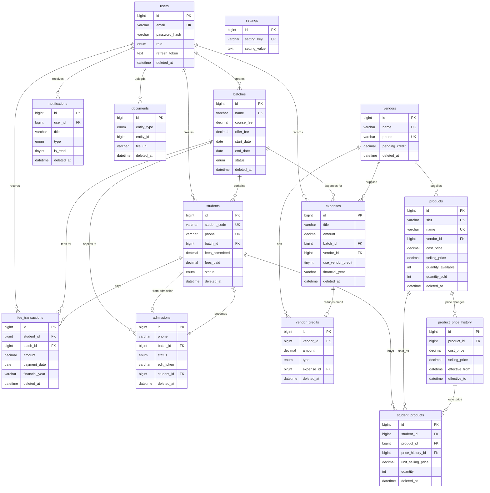

# Komal's Makeovers — ER Diagram

## Entity Relationship Diagram (Mermaid)

## Relationship Summary

| Parent | Child | Cardinality | On Delete |
|--------|-------|-------------|-----------|
| users | batches | 1:N | SET NULL |
| batches | students | 1:N | RESTRICT |
| students | fee_transactions | 1:N | RESTRICT |
| vendors | expenses | 1:N | SET NULL |
| vendors | vendor_credits | 1:N | RESTRICT |
| vendors | products | 1:N | SET NULL |
| products | product_price_history | 1:N | CASCADE |
| products | student_products | 1:N | RESTRICT |
| students | student_products | 1:N | RESTRICT |
| batches | admissions | 1:N | SET NULL |
| admissions | students | 1:1 | SET NULL |
| expenses | vendor_credits | 1:1 | SET NULL |

## Business Rule Enforcement (DB Level)

1. **Cannot delete batch with students** → `ON DELETE RESTRICT` on `students.batch_id`
2. **Cannot delete product already sold** → App checks `quantity_sold > 0` + `ON DELETE RESTRICT` on `student_products`
3. **Cannot delete vendor with pending credits** → App checks `pending_credit > 0`
4. **Historical prices immutable** → `student_products` stores frozen `unit_cost_price` / `unit_selling_price`
5. **Soft deletes** → All tables use `deleted_at` for logical deletion
